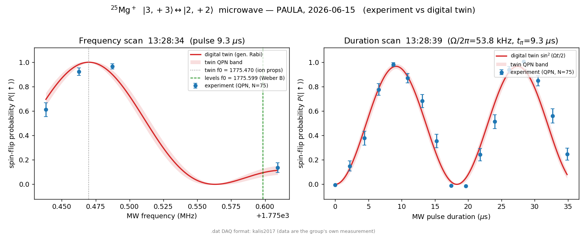

# PAULA `.dat` data-file format

The apparatus data-acquisition (DAQ) system writes one `.dat` file per
measurement (scan). The format — an XML metadata header carrying the full
experimental context, followed by the scan data — is documented in
[`kalis2017`](SOURCES.md) (Henning Kalis, PhD, Freiburg 2017). This note is the
working spec for *reading* those files into the digital twin, so that a benchmark
can cite not just a thesis value but the **raw measurement and all its settings**.

Example files live under [`sources/data/`](../sources/data/) and are committed
(they are our own primary data — unlike the copyrighted lineage PDFs, which are
not; see ADR-0002).

## File layout

```
#<?xml version="1.0" encoding="ISO-8859-15"?>        ← every metadata line is '#'-commented
#<metadata label="13:28:34"> … timestamp …
#<sampling>random</sampling>                          ← scan-point ordering
#<counter>0,1</counter>                               ← two acquisition counters
#<ionproperties> … <item name="X"><value>…</value></item> … </ionproperties>
#<parameter> … the SCANNED variable (l/u bounds, #points, shots/point) …
#<profiles> … <profile> …                             ← waveform/sequence profiles
#<shims> … <shim> … <no> …                            ← electrode / BEM shim fields
#<sourcecode><scrname>…</scrname> … </sourcecode>     ← the control SCRIPT
<scanned_var>  <value>  <error>  <timestamp_ms>       ← scan DATA: signal block, then reference block
… per-shot count histograms (count  #shots) …         ← one group per (scan point, counter)
```

### Header (all lines start with `#`)
- **`<ionproperties>`** — the parameter settings: hundreds of `<item name="…"><value>…</value></item>` control variables (laser/EOM/AOM levels, timings, the MW settings, etc.). Key MW fields: `EU_beam_fr` (base qubit frequency, MHz), `mw_fr_0/1`, `mw_t_0/1` (pulse times, µs), `mw_phs_0/1`, `mw_contr_high/low`.
- **`<parameter>`** — the scanned variable, e.g. `t_mw_3p3_2p2` with `<value_l>`/`<value_u>` bounds, `<int_points>` (number of points), `<exp_point>` (shots per point).
- **`<profiles>` / `<shims>` / `<sourcecode>`** — the waveform profiles, shim-field (electrode/BEM) settings, and the full control script — i.e. the complete sequence that produced the data.

### Data block (tab-separated, **not** `#`-commented)
Columns: `scanned_variable`, `value`, `error`, `timestamp_ms`. The two counters
(`<counter>0,1</counter>`) are written as **two consecutive blocks** (the scanned
variable restarts at the boundary), *not* interleaved per point: the ion-fluorescence
**signal**, and a near-constant **~0.013 reference/normalisation** counter (this is
*not* the dark-ion state). The reader picks the higher-variance block as the signal;
`error` is its per-point standard error (≈ shot noise over `exp_point` shots). The
trailing histogram groups likewise cover both counters (signal *and* reference).

## Worked examples — microwave Rabi on |F=3,m=+3⟩ ↔ |F=2,m=+2⟩

Two scans taken 5 s apart on 2026-06-15 (`sources/data/microwave/`):

| file | scan | range | result (quick read, pre-fit) |
|------|------|-------|------------------------------|
| `13_28_34_…dat` | **frequency** | 1775.34–1775.61 MHz, 12 pts | resonance dip at **~1775.49 MHz** (the 3,+3↔2,+2 transition) |
| `13_28_39_…dat` | **duration** `t_mw_3p3_2p2` | 0–34.875 µs, 17 pts | clean Rabi flop: min(π)≈8.7 µs, max(2π)≈18 µs, min(3π)≈27 µs → period ≈18 µs → **Ω/2π ≈ 52–57 kHz** |

The duration scan's Ω/2π is consistent with the tabulated `mw_rabi_3p3_2p2_doerr`
= 59.45 kHz (drive diagnostic); the frequency-scan resonance is a *field-sensitive*
ground-state transition the `levels` (Breit-Rabi) engine can predict.

**Experiment vs digital twin.** `python -m spike.plot_scans` overlays the
generalized-Rabi twin prediction on both scans with the quantum-projection-noise
band — every twin parameter (sample size N, the π-time → Ω, the resonance, the
pulse duration) read from the ion properties:


> The numbers above are quick min/period reads, **not** fits — a Lorentzian (for
> the resonance) and a damped cosine (for the Rabi flop) are needed before any
> value is recorded as a benchmark with an uncertainty.

## Proposed use in the twin (not yet wired)

1. A small reader (`spike/`) that parses the header (→ settings) + the signal
   counter (→ x, y, σ), keyed off the `<parameter>` scan definition.
2. Fit each scan; record the fitted values as **benchmarks with raw-data
   provenance** (`source.ref: kalis2017` + the `.dat` path):
   - the 3,+3↔2,+2 transition frequency → a `levels`-engine field-sensitive test
     (complements the field-insensitive clock);
   - the Rabi rate → an independent raw-data check of `mw_rabi_3p3_2p2`.
