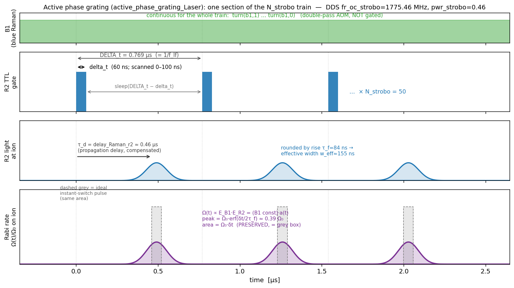
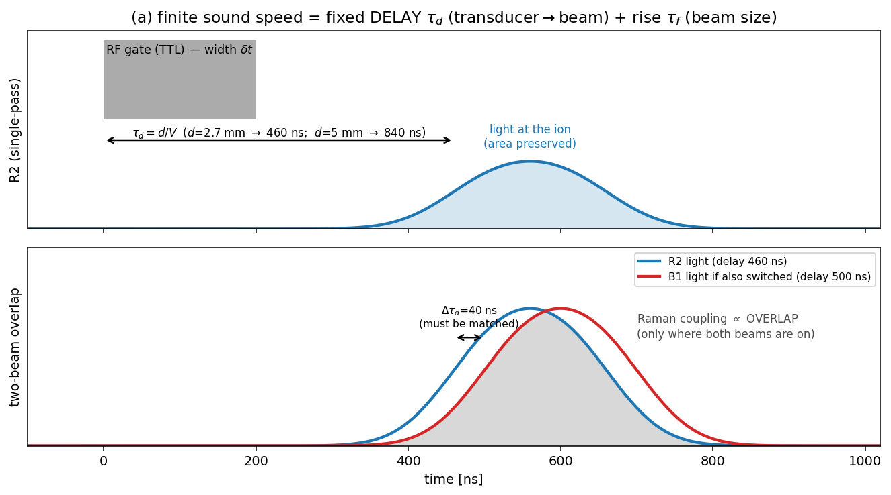
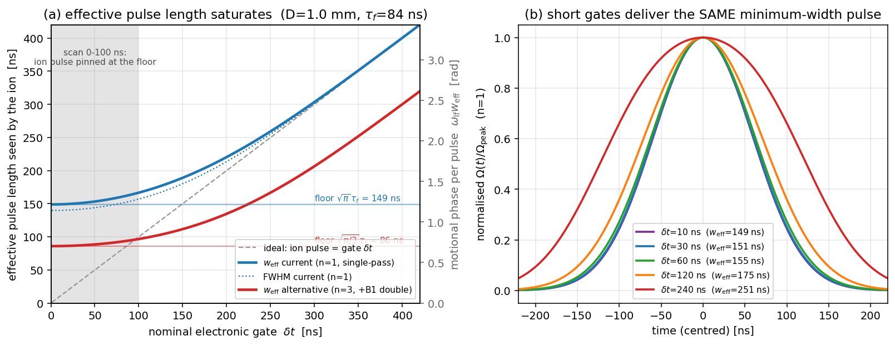
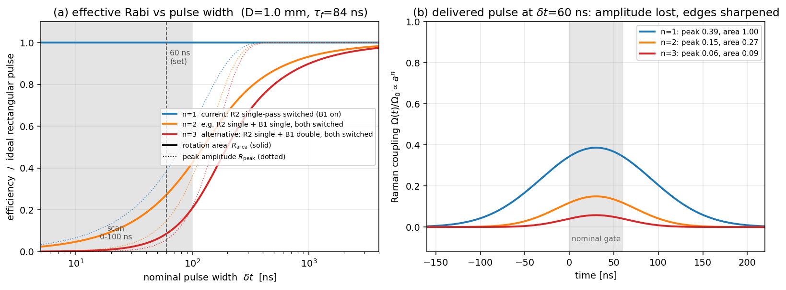
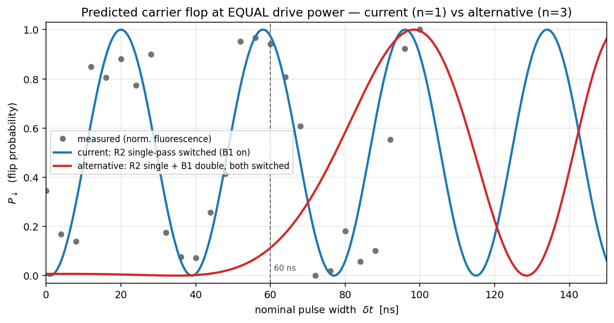
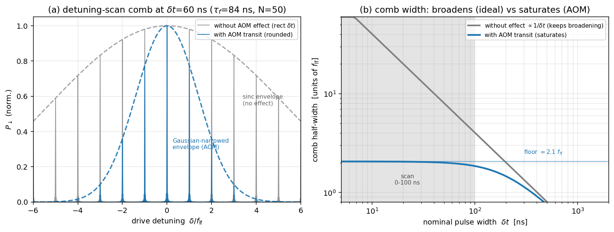
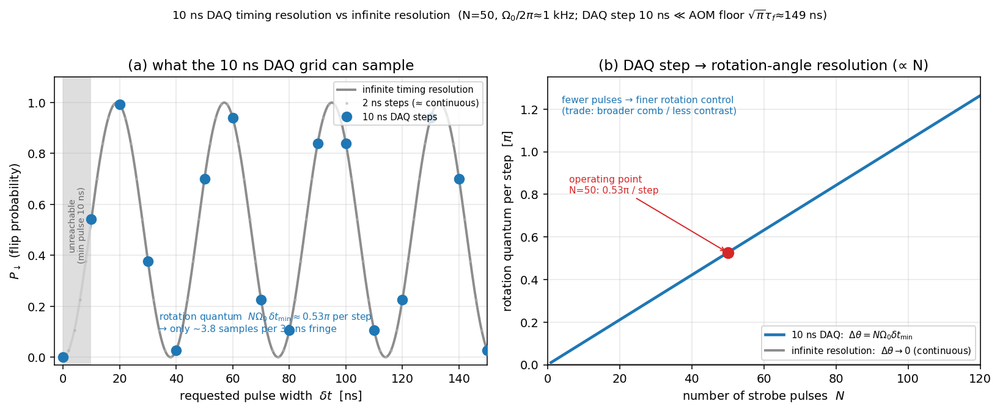

# Finite acoustic-transit effects on the stroboscopic R2 Rabi rate — single- vs double-pass switching

*Technical note, 2026-06-25. **Work in progress — preliminary results** (numbers provisional pending an in-situ AOM beam-size measurement; see Caveats). How the finite speed of sound in the Raman-beam AOM
shapes the effective Rabi drive of the Strobo2.0 "active phase grating", why switching
**only** the single-pass R2 beam **preserves the spin-rotation area** (so the ion still
flops), why the ion nevertheless sees an **effectively longer pulse whose width saturates
at a hard floor**, and what would change if the B1 (double-pass) AOM were switched too.
All numbers are computed in
[`docs/figures/make_aom_rise_figs.py`](../figures/make_aom_rise_figs.py); device constants
come from the AOM datasheet
([`intraaction_asm2202b3`](../../registries/sources.yaml) →
[`sources/spec sheets/intraact_aom220uv_specs.pdf`](../../sources/spec%20sheets/intraact_aom220uv_specs.pdf)).
The sequence is the decoded control script of
[`sources/data/Strobo2.0/1_FlopN_3p3_2p2_PDQ_displ_strobo/`](../../sources/data/Strobo2.0/1_FlopN_3p3_2p2_PDQ_displ_strobo/).*

## Plain-language overview (read me first)

An **acousto-optic modulator (AOM)** switches a laser beam by launching an ultrasonic wave
across it: the sound wave is a moving diffraction grating that deflects ("switches on") the
light. The catch is that **sound is slow** (≈ 6 mm/µs in fused silica), so the grating cannot
appear or disappear instantly — it has to *travel across the beam*. Two consequences follow,
both set by distances inside the AOM divided by the sound speed:

1. a **fixed delay** — the sound must first travel from the transducer to where the beam sits
   (a few mm → hundreds of ns) before *any* light switches; and
2. a **finite rise/fall** — once it arrives, the grating still takes the **beam-crossing time**
   (≈ beam size / sound speed ≈ 100 ns here) to fully cover the beam.

In the Strobo2.0 grating we chop **one** Raman beam (**R2**, on a single-pass AOM) into a train
of short pulses while the other beam (**B1**) stays on. This note shows the surprising-but-true
result that, *because only one beam is chopped*, the **area** of each light pulse — and hence the
spin rotation it produces — is **preserved even for pulses far shorter than the rise time**; the
slow turn-on is exactly cancelled by an equally slow turn-off tail. What is *not* preserved is the
**shape**: the ion sees a low, broad, **lengthened** pulse whose width **cannot be pushed below a
floor** of ≈ 150 ns no matter how short we make the electronic gate. We then compute what happens
in an alternative where **B1 (a double-pass AOM) is also switched** — there the rotation area
**collapses** at short pulses, because each diffraction event multiplies the suppression.

## Notation

| symbol | meaning | value here |
|---|---|---|
| $V$ | acoustic velocity in the AOM medium (fused silica) | **5.95 mm/µs** (datasheet) |
| $D$ | optical beam diameter ($1/e^2$ intensity) in the AOM | ~1 mm (aperture height 2 mm) |
| $w=D/2$ | beam $1/e^2$ intensity radius / field $1/e$ radius | ~0.5 mm |
| $\tau_f=w/V=D/2V$ | **field rise** time constant (beam-crossing) | **84 ns** (D=1 mm) |
| $T_r=0.64\,D/V$ | datasheet 10–90 % **intensity** rise time | **110 ns** (D=1 mm) |
| $\tau_d=d/V$ | **propagation delay**, transducer→beam ($d$ = standoff) | 460–840 ns (see §1) |
| $\delta t$ | nominal electronic gate width (the scanned variable `delta_t`) | 0–100 ns (this file) |
| $\delta t_{\min}$ | DAQ timing step (smallest realizable gate / increment) | **10 ns** |
| $\Delta_t$ | strobe period (= lf motional period $1/f_{\rm lf}$) | 0.769 µs |
| $N$ | number of strobe pulses (`N_strobo_OC_lf_PDQ`) | 50 |
| $f_{\rm lf}$ | low-frequency axial mode | 1.300 MHz |
| $a(t)$ | single-pass diffracted **field** envelope, normalised to 1 | — |
| $n$ | number of **switched** diffraction-amplitude factors | 1 (current) … 3 (alt.) |
| $\Omega_0$ | two-photon carrier Rabi rate at full diffraction | ~2π·0.5 MHz (from data) |

## 0. The sequence (what is switched)

From the decoded control script (`active_phase_grating_Laser(b1, r2, …)`, `sel==1`):

```c
set_dds(dds_strobo, fr_oc_strobo, phase, pwr_strobo);
turn(b1, 1);                                   // B1 ON for the whole grating (continuous)
sleep((N_max - N_strobo) * DELTA_t);
for (i = 1; i < N_strobo + 0.5; i++){
    sleep(DELTA_t - delta_t);
    turn(r2, 1);  sleep(delta_t);  turn(r2, 0); // R2 chopped: ON for delta_t, N times
}
turn(b1, 0);
```

The drive is a **two-photon stimulated-Raman carrier** (B1 + R2). The two-photon Rabi rate is the
**product** of the two single-beam fields at the ion,
$\Omega(t)\propto E_{\rm B1}(t)\,E_{\rm R2}(t)$.
**B1 is continuous** ($E_{\rm B1}=$ const); **only R2 is switched.** This single fact drives the
entire analysis below.

The figure maps the script parameters onto one section of the $N_{\rm strobo}$ train — B1 (always on),
the R2 TTL gate (width `delta_t`, period `DELTA_t`; the literal control signal, dotted guides mark the gate
times), the delivered R2 light (shifted one propagation delay $\tau_d=$ `delay_Raman_r2` to the right of its
gate and rounded by the rise $\tau_f$), and the Rabi rate the ion actually sees
($\Omega\propto E_{\rm B1}E_{\rm R2}\propto a(t)$, with the ideal instant-switch pulse in dashed grey for
comparison — **same area**, §3):



## 1. Three distinct finite-sound-speed effects

Decompose the geometry inside the AOM into three independent length scales ÷ $V$:

| effect | length scale | timescale | what it does |
|---|---|---|---|
| **propagation delay** $\tau_d$ | transducer→beam standoff $d$ (~3–5 mm) | 460–840 ns | rigid **time-shift** of the whole pulse |
| **rise/fall** $\tau_f$ | beam size $w=D/2$ (~0.5 mm) | 84 ns | **rounds + lengthens** the pulse, drops its peak |
| **pass multiplicity** $n$ | optical passes × beams switched | — | sets whether **area** survives short pulses |

### The propagation delay $\tau_d$

The acoustic wave is launched at the transducer and must travel the standoff distance $d$ to the
beam before any light appears: $\tau_d = d/V$. For the "typical ~5 mm" standoff this is
$\tau_d = 5\,{\rm mm}/(5.95\,{\rm mm/µs}) \approx \mathbf{840\ ns}$. The apparatus standoff is
actually a bit smaller — the script's **compensated** delays are `delay_Raman_r2 = 0.46 µs` and
`delay_Raman_b1 = 0.50 µs`, i.e. $d_{\rm R2}\approx 2.7$ mm, $d_{\rm B1}\approx 3.0$ mm.



Key points (figure above):
- $\tau_d$ is a **pure delay** — *both* the on-edge and the off-edge are shifted by the same
  $\tau_d$, so it does **not** change the pulse shape or area. It just means the light arrives
  $\tau_d$ **after** the TTL gate. It must be (and is) **compensated in the pulse timing**.
- The dangerous part is the **differential** delay between the two Raman beams,
  $\Delta\tau_d = (d_{\rm B1}-d_{\rm R2})/V \approx 40$ ns here. The Raman coupling exists only
  where **both** beams overlap in time; a mismatched $\Delta\tau_d$ shifts R2's pulse off B1 and
  kills the overlap.
- In the **current** grating B1 is **continuous** (turned on once for the whole train), so the
  40 ns differential is harmless — it is absorbed by the long initial B1-on wait
  ($(N_{\max}-N_{\rm strobo})\Delta_t\approx 38.5$ µs) and only R2's (constant) delay matters.
  The grating loop uses plain `turn(beam2, …)`, **not** `turn_2_Raman_AOMs` — that staggered
  two-beam helper is what the *ordinary* Raman pulses use (`rtpulse_new`) and is exactly what the
  **alternative** (§4) would need, where gating B1 too makes $\Delta\tau_d$ a live, per-pulse
  alignment requirement.

## 2. The rise model (anchored to the datasheet)

A single rising acoustic edge sweeps the Gaussian beam, so the diffracted **field** rises as an
error function. For a gate that turns the RF on at $t=0$ and off at $t=\delta t$, the delivered
single-pass field envelope is a **rounded box**:

$$\boxed{\,a(t)=\tfrac12\!\left[\operatorname{erf}\!\frac{t}{\tau_f}-\operatorname{erf}\!\frac{t-\delta t}{\tau_f}\right],\qquad \tau_f=\frac{w}{V}=\frac{D}{2V}\,}$$

Two exact properties of this rounded box (both proved by direct integration):

- **Peak:** $a_{\rm peak}=\operatorname{erf}\!\big(\delta t/2\tau_f\big)$ — drops well below 1 once $\delta t\lesssim T_r$.
- **Area:** $\displaystyle\int a(t)\,dt = \delta t$ **exactly, for any $\delta t$** — the slow turn-on
  is *identically* compensated by the equally slow turn-off tail.

Cross-check against the datasheet: the model's **intensity** ($a^2$) 10–90 % rise is $\approx 0.75\,D/V$
(= 125 ns at D=1 mm), versus the datasheet's $T_r = 0.64\,D/V$ (= 110 ns). The ~15 % difference is the
known coherent-field vs geometric-power convention; both agree that the relevant timescale is the
**beam-crossing time** $\sim D/V \sim 0.1$ µs.

## 3. Single-pass switching (current scheme): area is preserved, the pulse is *lengthened*

Because only R2 is switched and the Raman rate follows the **field** of the switched beam,
$\Omega(t)\propto a(t)$ (exponent $n=1$). Therefore the **rotation per pulse is preserved**:

$$\theta_{\rm pulse}=\Omega_0\!\int a(t)\,dt=\Omega_0\,\delta t\quad\text{(independent of }\tau_f).$$

So the stroboscopic flop in $\delta t$ stays **linear in $\delta t$** down to $\delta t\to 0$ — there is
**no first-order Rabi-rate reduction** of the spin response. The data are consistent with this and rule out
the strongly-suppressed alternative (§5).

**But the ion does *not* see a $\delta t$-long pulse.** With the area pinned at $\delta t$ and the peak
suppressed to $a_{\rm peak}$, the pulse is spread out. The natural "equivalent-rectangle" width is

$$w_{\rm eff}(\delta t)=\frac{\int a\,dt}{a_{\rm peak}}=\frac{\delta t}{\operatorname{erf}(\delta t/2\tau_f)}\;\xrightarrow[\delta t\to 0]{}\;\sqrt{\pi}\,\tau_f .$$

**The effective pulse length saturates at a floor $\sqrt{\pi}\,\tau_f\approx 1.77\,\tau_f\approx \mathbf{149\ ns}$
(D=1 mm).** No matter how short the electronic gate, the ion sees a pulse **at least ~150 ns wide**.



| $\delta t$ (gate) | peak $a_{\rm peak}$ | area / $\delta t$ | $w_{\rm eff}$ | FWHM |
|---:|---:|---:|---:|---:|
| 10 ns | 0.067 | **1.00** | **149 ns** | 140 ns |
| 30 ns | 0.199 | **1.00** | 151 ns | 141 ns |
| 60 ns | 0.386 | **1.00** | 155 ns | 146 ns |
| 100 ns | 0.600 | **1.00** | 167 ns | 157 ns |
| 200 ns | 0.936 | **1.00** | 220 ns | 214 ns |
| 1000 ns | 1.000 | **1.00** | 1000 ns | 1000 ns |

Consequence for the grating: the strobe "kick" is **not** δ-like. At the floor the pulse smears over a
motional phase $\omega_{\rm lf}\,w_{\rm eff} = 2\pi f_{\rm lf}\cdot 149\,{\rm ns}\approx \mathbf{1.2\ rad}$
per pulse — a sizeable fraction of a motional period. This is exactly the in-pulse motional-sampling
term flagged as the leading approximation in
[`strobo_sim`](../../spike/engines/strobo_sim.py) / the
[transfer-function note](strobo_grating_transfer_function.md); the AOM rise sets a **hard lower bound**
on how impulsive the kicks can be, independent of the DAQ's 10 ns timing resolution.

## 4. Alternative: also switch B1 (double-pass) — the rotation area collapses

In a **double-pass** AOM the light traverses the same acoustic grating **twice**, so its field picks up
the diffraction amplitude **squared**: $E_{\rm B1}^{\rm (2pass)}(t)\propto a(t)^2$. If B1 is *also* gated,
the Raman rate carries **three** switched diffraction factors:

$$\Omega_{\rm alt}(t)\propto \underbrace{a(t)}_{\text{R2 single}}\cdot \underbrace{a(t)^2}_{\text{B1 double}}=a(t)^{\,3}\qquad(n=3).$$

Generally $\Omega(t)\propto a(t)^n$ with $n$ = number of switched amplitude factors (current $n{=}1$;
switch both single-pass $n{=}2$; R2 single + B1 double $n{=}3$). The rotation area is now

$$R_{\rm area}(\delta t)=\frac{1}{\delta t}\!\int a^n\,dt,\qquad
R_{\rm area}\xrightarrow[\delta t\to0]{}\;\propto\!\Big(\tfrac{\delta t}{\tau_f}\Big)^{\,n-1}.$$

Each extra switched diffraction factor costs **one more power of $(\delta t/\tau_f)$** at short pulses:
$n{=}1$ is flat (preserved), $n{=}2$ falls $\propto\delta t$, $n{=}3$ falls $\propto\delta t^2$.



| $\delta t$ | $R_{\rm area}$, $n{=}1$ (current) | $R_{\rm area}$, $n{=}2$ | $R_{\rm area}$, $n{=}3$ (alt.) | peak $n{=}3$ |
|---:|---:|---:|---:|---:|
| 10 ns | **1.00** | 0.05 | 0.003 | 0.0003 |
| 30 ns | **1.00** | 0.14 | 0.023 | 0.008 |
| 60 ns | **1.00** | 0.27 | 0.086 | 0.058 |
| 100 ns | **1.00** | 0.43 | 0.209 | 0.216 |
| 200 ns | **1.00** | 0.69 | 0.504 | 0.580 |
| 1000 ns | **1.00** | 0.93 | 0.899 | 0.999 |

**Trade-off.** Switching both beams (and double-passing B1) makes each delivered pulse much **sharper**
and gives much better **extinction** (the tails are $a^3$ instead of $a$, and the effective-length floor
drops to $\sqrt{\pi/3}\,\tau_f\approx 86$ ns). That is attractive for a clean Floquet comb. The price is
steep: at the operating point $\delta t=60$ ns the per-pulse rotation falls to **~9 %** ($n{=}3$) of the
single-pass value, so to recover the same flop you need **~11.6× more two-photon Rabi *amplitude***. With
$\Omega_{\rm full}\propto P_{\rm B1}\sqrt{P_{\rm R2}}$ that translates — depending on which power you raise —
to **~5× more optical power in *each* beam** if both are scaled together ($\Omega\propto P^{3/2}$),
or ~12× in the double-pass B1 alone ($\Omega\propto P_{\rm B1}$), or ~130× in R2 alone
($\Omega\propto\sqrt{P_{\rm R2}}$). And the datasheet's $\eta=\sin^2(\propto\sqrt{P})$ caps how far the power
can be pushed before the AOM saturates/over-drives. Net: **double-pass switching buys temporal sharpness and
extinction at a large cost in rotation efficiency** for sub-$T_r$ pulses.

## 5. What the data say (the flop tracks $n=1$)

The finest scan (`10_22_22…`, $\delta t$ = 0–100 ns, $N$=50) shows a **clean carrier flop that oscillates
with a roughly constant ~38 ns period in $\delta t$ down to ~12 ns** — the signature of a rotation that is
**linear in $\delta t$**, i.e. area-preserved ($n{=}1$). This is a strong *shape* discriminator, not a
peak-height claim: an $n{=}3$ response (area $\propto\delta t^3$ at small $\delta t$) would reach its **first**
fringe maximum only near ~95 ns, whereas the data show <strong>~3 full oscillations within 0–100 ns</strong>. The data
are therefore consistent with $n{=}1$ and **rule out $n{=}3$**.



Overlaying the predicted carrier flop at **equal drive power**, the measured points track the **current
($n{=}1$, blue)** curve while the **alternative ($n{=}3$, red)** barely reaches its first π by ~95 ns.
*Caveat — this is a shape comparison, not a fit:* the data are min–max-normalised fluorescence (arb. units),
the period is read from the fringe spacing (~38 ns, not least-squares fitted), and the model phase is set by
hand to the prepared displaced state. A proper damped-cosine fit (free $\Omega_0$, contrast, phase) with a
residual/$\chi^2$ — and ideally a global fit across the whole 0–1.2 µs `delta_t` campaign — would turn this
"consistent with / rules out" into a quantitative confirmation; that is left as a follow-up.

## 5a. Does the ion's finite size / the 50 µm focus matter? (No)

A natural worry: the rise model lives in the **AOM plane** (beam $D\!\approx\!1$ mm), but at the **ion**
the R2 beam is refocused to a waist $w_{\rm ion}\approx 50$ µm, while the ion's wavepacket is only
$x_{\rm zpf}\approx 12$ nm ($^{25}$Mg$^+$ at $f_{\rm lf}=1.300$ MHz — i.e. the "~10 nm" scale).
Do we need to fold that in? **No**, by a wide margin:

- **Scale separation.** $x_{\rm zpf}/w_{\rm ion}\approx 2.5\times10^{-4}$. The intensity varies across the
  ion by $1-e^{-2(x/w)^2}\approx 1.2\times10^{-7}$ — the ion is a **perfect point sampler** of the beam.
  So the on-axis focal field $a(t)$ we modelled (= $\int$ aperture field) is *exactly* what the ion sees;
  finite ion size adds nothing to the Rabi magnitude.
- **It is the wrong kind of coupling anyway.** The Gaussian-beam **intensity-gradient** coupling to motion
  is $\eta_I=x_{\rm zpf}/w_{\rm ion}\approx 2.5\times10^{-4}$, about **6 400× weaker** than the optical
  **Lamb–Dicke recoil** $\eta=k_{\rm eff}x_{\rm zpf}\approx 0.39$ that already drives the grating (and is in
  [`strobo_sim`](../../spike/engines/strobo_sim.py)). The 50 µm focus is essentially flat over the motion.
- **Transient focal-spot distortion** during the ~150 ns rise (the AOM aperture is partly filled → the focus
  broadens/shifts) affects the **on-axis amplitude**, which is *already* in $a(t)$; the residual *lateral*
  spot shift is a small fraction of 50 µm — still ~5 000× the ion — so the ion remains a point sampler. The
  RF frequency is **fixed** (gated, not swept), so there is **no steady beam-steering shift** of the spot on
  the ion. Net: at most a bounded few-% amplitude wobble confined to the rise window, not an area effect.

So keep the **point-ion, on-axis $a(t)$** treatment; the 50 µm-vs-10 nm scale separation makes the ion's
finite size irrelevant here.

## 5b. Frequency-domain fingerprint: the detuning-scan comb

The cleanest *experimentally traceable* signature is in the **detuning scan**, because the delivered
pulse shape and the comb are Fourier conjugates. In the **weak-pulse / linear-response limit**
($\theta\ll1$ per pulse, total $N\theta\lesssim\pi$ — the regime where the spin amplitude is the linear
sum of per-pulse contributions) a train of $N$ identical pulses at period $\Delta_t$, driven at detuning
$\delta$, gives a spin-flip probability that factorises:

$$P_\downarrow(\delta)\;\propto\;\underbrace{\Big|\tfrac{\sin(N\pi\delta\Delta_t)}{N\sin(\pi\delta\Delta_t)}\Big|^2}_{\text{array factor (the comb)}}\;\times\;\underbrace{|\tilde a(\delta)|^2}_{\text{single-pulse envelope}}.$$

The **array factor** is the same with or without the AOM effect: it places the comb **teeth** at
$\delta=k/\Delta_t=k f_{\rm lf}$ and sets their **width** $\sim 1/(N\Delta_t)$. The AOM transit enters
**only** through the **single-pulse spectral envelope** $|\tilde a(\delta)|^2$, the Fourier transform of
the delivered pulse:

$$|\tilde a(\delta)|^2=\underbrace{\operatorname{sinc}^2(\pi\delta\,\delta t)}_{\text{from the gate width}}\times\underbrace{\exp\!\big[-2\pi^2\tau_f^2\delta^2\big]}_{\textbf{AOM Gaussian roll-off}} .$$



- **Without the effect** (ideal rectangle): the envelope is a **sinc**, first zero at $\delta=1/\delta t$.
  For short gates this is *broad* — at $\delta t=60$ ns the comb carries strong teeth out to
  $\pm 13\,f_{\rm lf}$; at $\delta t=10$ ns out to $\pm 100\,f_{\rm lf}$ (≈100 MHz). The number of resolved
  teeth grows $\propto 1/\delta t$.
- **With the AOM transit**: the extra **Gaussian** factor has a $1/e$ half-width
  $\delta_{1/e}=1/(\sqrt2\,\pi\tau_f)\approx 2.1\,f_{\rm lf}\approx 2.7$ MHz, **independent of $\delta t$**.
  It cuts the comb long before the sinc does, so the comb is **Gaussian-narrowed** and its width
  **saturates** — shrinking $\delta t$ below ~370 ns does *not* broaden it (panel b). This is the exact
  **Fourier mirror of the time-domain pulse-length floor** (§3): a long, smooth pulse ⇔ a narrow,
  saturated comb.

**How to see it / measure $\tau_f$.** Run the detuning scan at a few gate widths (e.g. $\delta t$ = 10, 30,
60, 100 ns). Without the effect the comb keeps broadening; with it the comb stays pinned at $\pm 2$–$3$
teeth for all of them. Quantitatively, the **carrier-normalised tooth heights**
$R_k=P_\downarrow(k f_{\rm lf})/P_\downarrow(0)=\operatorname{sinc}^2(\pi k f_{\rm lf}\delta t)\,e^{-2\pi^2\tau_f^2(k f_{\rm lf})^2}$
carry $\tau_f$ directly: e.g. at fixed small $\delta t$ the ratio of the $|k|{=}2$ to the $k{=}0$ tooth is
$\approx e^{-2\pi^2\tau_f^2(2f_{\rm lf})^2}$, a clean, drift-robust read of the **beam size in the AOM**
(hence a cross-check of $\tau_f=D/2V$ against the datasheet).

*Relation to the propagator.* [`strobo_sim`](../../spike/engines/strobo_sim.py) currently uses
**instantaneous** pulses, so it produces the bare comb with **no** single-pulse envelope (flat teeth, up
to the Fock/displacement structure). Finite $\delta t$ multiplies in the sinc; the AOM transit multiplies
in the Gaussian. Because the envelope is **multiplicative and motion-independent** (the weak-pulse caveat
above), it can be folded onto *any* comb the propagator returns: the function
[`aom_rise.comb_envelope`](../../spike/engines/aom_rise.py) exists and is tested — wiring it onto the
`strobo_sim` output is a small follow-up (not yet done).

## 5c. DAQ timing resolution: the 10 ns step vs infinite resolution

Everything above treats $\delta t$ as a continuous ("infinite-resolution") knob. The real
sequencer can only set the gate in finite increments — the **smallest reliable step is
$\delta t_{\min}=10$ ns** — so the shortest realizable pulse is 10 ns and the achievable
operating points lie on a 10 ns grid. This is a **digital** limit, entirely separate from the
analog AOM physics, and it lands on a **different axis**:

- **The AOM sets the pulse *shape*** — the delivered pulse can't be narrower than the floor
  $\sqrt{\pi}\,\tau_f\approx150$ ns (§3), no matter the timing.
- **The DAQ sets the *requested-width granularity*** — hence how finely the **rotation** can be
  dialled. Because the single-pass area is preserved, a 10 ns step is a faithful **rotation
  quantum** $\Delta\theta = N\,\Omega_0\,\delta t_{\min}$.



At the operating point ($N=50$, $\Omega_0/2\pi\approx0.53$ MHz from the ~38 ns fringe) this quantum
is **$\Delta\theta\approx0.53\,\pi$ per 10 ns step** — so the flop is sampled at only <strong>~3.8 points
per fringe</strong> (panel a). With infinite resolution the flop is continuous; the 10 ns DAQ just
**undersamples** it (barely above Nyquist) and **cannot reach** $0<\delta t<10$ ns at all. Note the
roles do **not** swap: infinite timing would *not* sharpen the pulse (that is the AOM's job) — it
would only give continuous rotation control.

Three consequences worth keeping in mind:

- **The 10 ns floor wastes nothing.** At $\delta t=10$ ns the AOM peak is only ~7 % of full, but the
  *area* is still $\Omega_0\cdot10$ ns (preserved) — the smallest realizable pulse still delivers its
  full nominal rotation quantum, merely spread over ~150 ns.
- **Finer rotation control ⇒ fewer pulses.** $\Delta\theta\propto N$ (panel b): halving $N$ halves the
  quantum. The cost is a broader/weaker comb (tooth width $\propto1/N$), so it trades angle resolution
  against frequency selectivity and contrast. Lowering $\Omega_0$ (drive power) does the same.
- **Sub-10 ns scan structure is not trustworthy.** The example file requests $\delta t$ on a ~4 ns
  nominal grid (0–100 ns, 26 pts) — finer than $\delta t_{\min}$ — so adjacent fine points fall within
  the timing quantization and the realized $\delta t$ snaps toward the 10 ns grid; treat sub-10 ns
  differences as unresolved (a likely contributor to point-to-point scatter in the fine flop).

## 6. Summary

- The finite speed of sound enters as **three** scales: a **delay** $\tau_d=d/V$ (~0.46–0.84 µs, a benign
  compensated shift — but the **B1–R2 differential** must be matched), a **rise** $\tau_f=D/2V$ (~84 ns,
  the pulse-shaping scale), and the **pass multiplicity** $n$.
- **Because only the single-pass R2 is switched ($n{=}1$), the per-pulse rotation *area* is preserved**
  ($\int a\,dt=\delta t$) — the slow turn-on is cancelled by the slow turn-off tail. The ion still flops
  cleanly and linearly in $\delta t$, **consistent with the data (which rule out $n{=}3$)**. There is **no significant effective
  Rabi-rate reduction of the spin response** in the current scheme.
- **The ion nevertheless sees an effectively *longer* pulse**, of width $w_{\rm eff}=\delta t/\operatorname{erf}(\delta t/2\tau_f)$,
  which **saturates at $\sqrt{\pi}\,\tau_f\approx 150$ ns** — a hard floor: sub-150 ns kicks are impossible
  with this beam size, and each kick smears ~1.2 rad of motional phase.
- **Switching B1 (double-pass) too ($n{=}3$) collapses the rotation area** as $(\delta t/\tau_f)^2$
  (~9 % at 60 ns) in exchange for sharper, better-extinguished pulses. Only worthwhile if pulses are kept
  $\gtrsim T_r$ or the power budget can absorb the ~10× hit.
- **To get genuinely shorter, sharper kicks** without the efficiency collapse, **shrink the beam in the
  AOM** ($\tau_f\propto D$): focusing R2 to D≈0.3 mm drops $\tau_f$ to ~25 ns and the floor to ~45 ns.
- **Frequency-domain fingerprint (traceable):** the detuning-scan comb keeps the same tooth positions
  ($k f_{\rm lf}$) but its **envelope is the Fourier transform of the delivered pulse**. The AOM adds a
  **Gaussian roll-off** of $1/e$ half-width $\approx 2.1\,f_{\rm lf}$ that is **independent of $\delta t$**:
  the comb is narrowed and its width **saturates** instead of broadening as $1/\delta t$. The
  carrier-normalised $|k|{=}2$ tooth height is a direct, drift-robust read of $\tau_f$ (the AOM beam size).
- **DAQ 10 ns timing step (≠ the AOM, different axis).** The sequencer quantises the *requested* width in
  $\delta t_{\min}=10$ ns steps (min pulse 10 ns), which — via area preservation — quantises the **rotation**
  in steps $\Delta\theta=N\Omega_0\delta t_{\min}\approx0.53\,\pi$ (here), i.e. only ~3.8 samples per flop
  fringe. Infinite resolution gives a continuous flop but would **not** sharpen the pulse (that is the AOM
  floor, ~150 ns ≫ 10 ns). Finer angle control ⇒ fewer pulses ($\Delta\theta\propto N$).

## Provenance & reproduce

- Device constants: [`intraaction_asm2202b3`](../../registries/sources.yaml) (ASM-2202B3 datasheet) —
  $V=5.95$ mm/µs, $T_r=0.64\,D/V$, fused silica, 220 MHz, 2 mm aperture.
- Sequence & timings: [`paula_strobo_2026`](../../registries/sources.yaml) `.dat` headers — `DELTA_t`,
  `N_strobo_OC_lf_PDQ`, `delta_t`, `delay_Raman_{r2,b1}`, `fr_r2`=222 MHz; decoded `active_phase_grating_Laser`.
- Canonical model: [`spike/engines/aom_rise.py`](../../spike/engines/aom_rise.py) (pure Python, no numpy —
  portable across numpy 1.x/2.x; note that `numpy.trapz` is *removed* in numpy ≥2.3 and `numpy.trapezoid`
  is *absent* in numpy <2.0, so the model does its own integration). Tested in
  [`spike/test_aom_rise.py`](../../spike/test_aom_rise.py) (area theorem, peak, width floor, comb envelope).
- Figures & table: `python docs/figures/make_aom_rise_figs.py` (matplotlib; imports the model above and reads
  the measured flop via [`spike/datfile.py`](../../spike/datfile.py)) → `aom_strobe_sequence.png`,
  `aom_acoustic_delay.png`, `aom_single_vs_double_pass.png`, `aom_effective_pulse_length.png`,
  `aom_flop_single_vs_double_pass.png`, `aom_detuning_comb.png`, `aom_daq_resolution.png`, and the numeric
  table `aom_rise_table.csv`.

## Caveats

**Load-bearing assumptions** (the "area preserved" and "hard floor" claims rest on these):

- **Beam size $D$ is not yet measured** — the *entire* analysis scales linearly with $D$ ($\tau_f\propto D$,
  floor $\propto D$). $D$ is taken as the $1/e^2$ **diameter** ≈ 1 mm; "waist" could mean the radius
  (→ D≈2 mm, all timescales ×2), and the 2 mm sound-field aperture caps it. **All numbers here are provisional**
  until $D$ (or $\tau_f$) is measured — the §5b $|k|{=}2$ tooth-height method is the cleanest in-situ way to
  pin it. Scalings for D = 0.5/1/2 mm are in the script.
- **Linear (un-saturated) diffraction** is assumed, so field $\propto$ acoustic amplitude and the on/off edges
  cancel cleanly. Near peak efficiency $\eta=\sin^2(c\sqrt{P})$ the response curves over and the rising/falling
  edges no longer cancel → a genuine area loss appears **even at $n{=}1$**. The size scales with the working
  $\eta$: at $\eta_0\lesssim0.3$ the deviation from linear is $\lesssim$ few %, at $\eta_0\to1$ it is order-unity.
  `pwr_strobo`=0.46 / `pwr_r2`=0.425 are **DAC drive settings, not calibrated efficiencies**, so this cannot be
  bounded from the header alone — a scope trace of the diffracted R2 pulse (and its $\eta$) is needed to confirm
  the linear regime.
- **Symmetric on/off transients** are assumed. If the RF switch/amplifier has different turn-on vs turn-off
  behaviour (or a phase chirp), the off-tail no longer mirrors the on-edge and the area theorem breaks at $n{=}1$.
- **Detuning-comb factorisation is weak-pulse** ($N\theta\lesssim\pi$). At the working point $N\theta\approx\pi$
  the product form (§5b) is a good approximation for the tooth-height *envelope* but not exact; the true comb
  comes from the full Floquet propagator ([`strobo_sim`](../../spike/engines/strobo_sim.py)).

**Higher-order physical effects not in the on-axis field model** (each would only *reduce* coupling / degrade
extinction — they do not rescue the floor, and most are genuinely small here, but they bound the "hard" claims):

- **Spatial-mode / Bragg walk-off** during partial aperture fill (distorted/displaced focus) — second order given
  the 50 µm focus vs 10 nm ion (§5a), but it reduces overlap during the rise window.
- **B1's own turn-on**: B1 is continuous *during* the train but is switched on at the start, so the first one or
  two of the $N{=}50$ R2 pulses may see B1 still ramping (its own $\tau_f$) — a small ($\lesssim$ few %) first-pulse
  area/phase offset, neglected here.
- **Acoustic attenuation/dispersion** in fused silica at 220 MHz over the 3–5 mm path, and **acoustic echoes**
  from the crystal far face (round-trip $\sim$µs) leaking low-level diffraction into "off" windows.
- **RF-switch/DDS settling and phase transients** (fast, but the acoustic envelope is the optical beam convolved
  with the *real* RF step, not an ideal one).
- **Beam clipping** at the 2 mm aperture if the $1/e^2$ tails are not fully passed (would steepen the rise and
  break the pure Gaussian-erf form), and **zeroth-order / higher-order leakage** setting the real extinction ratio.
- **Thermal lensing/heating** from pulsing the AOM (negligible duty here, listed for completeness).

This is a **drive-shaping** model; it does not include motion during the pulse (that is `strobo_sim`'s job) or
decoherence. The AOM spectral envelope (`aom_rise.comb_envelope`) is a multiplicative, motion-independent filter
that *can* be folded onto the `strobo_sim` comb — the function exists; the one-line wiring into the propagator
output is a small, untested follow-up, not yet done.
